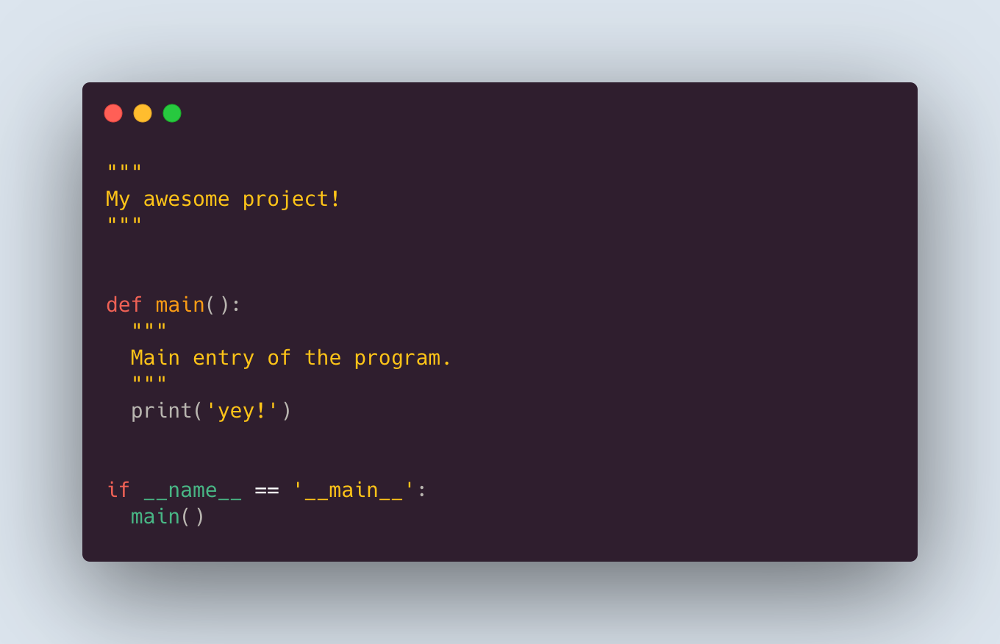

# Projects!

### Description

<!--  carbon code -- can you guess what it does? Run and see the result!
"""
My awesome project!
"""

def main():
  """
  Main entry of the program.
  """
  print('yey!')
  

if __name__ == '__main__':
  main()
-->

Project is simple. Make a python application that is importable and executable from command line. You will select a project from list of projects, and will make this project into a working python application. 

### Rules & Guidelines

Here are some rules **to be followed**, with no exceptions!

- You need to write your code on a python file or files, no notebooks.
- Code should be well written, following [PEP8](https://www.python.org/dev/peps/pep-0008/) guidelines.
- Code should be documented, where in each function or class you making, you should clearly state:
  -  a description of what that code does
  -  what are the arguments, and what data types can these arguments get
  -  what output your function returns, of what type
  -  example(s) of how to use that function and what it returns
- Your python file, module, should also have a docstring, that explains:
  -  a description of what your program is 
  -  how to use it from command line
  -  how to use when importing
  -  example uses and example outputs
- Code should be importable. Functions in your python file should be importable from another python file.
- Code should be executable. That is, it should have an entry point to be used as command line application.

### Requirements

In all the projects available in this repository, there is a simple flow that every project follows:

- Read or write data to a file
- Print some information to user
- Ask for an input from user
- Based on the input, evaluate some logic, and do an action
- Provide summary or stats from your collected data

The main flow that every project needs to do is the following.

- Make yourself a sample dataset. Uploading dataset to your repository is fine for this project's purpose.
- Make a single function or class that interacts with the data. Meaning:
  - Read file in one place, don't do `with open('some file.txt')...` in everywhere.
  - Write data to file from a single function. If something needs to be written to file, use this function.
- Your code should have a `main()` function. Check out why [main is important and how you can do](https://realpython.com/python-main-function/) it.
- You don't need any third party packages, but you may need standard library modules and packages.
- Project should meet its objectives mentioned in project description.

### References

Google's style guide for [comments and docstrings](https://google.github.io/styleguide/pyguide.html#38-comments-and-docstrings).